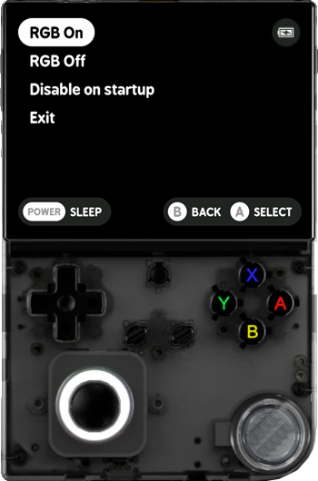

# RG40XXV "RGB settings" Tool

## Description

This project is a lightweight Bash-based tool designed to control the RGB LED behavior of the analog stick on the [Anbernic RG40XXV](https://anbernic.com/fr-fr/products/rg-40xxv) handheld console running [MinUI](https://github.com/shauninman/MinUI).

It provides simple and reliable actions to:

- Enable RGB lighting (white).
- Disable RGB lighting.
- Configure automatic RGB activation at boot.

The tool follows the minimalist philosophy of [MinUI](https://github.com/shauninman/MinUI): a lightweight menu-driven interface, fast execution and minimal system modifications.

> Compatibility
> - Device: RG40XXV.
> - Platform: Anbernic H700.
> - OS: MinUI.
>
> This tool is not guaranteed to work on other devices.

## Objectives

- Provide a simple and reliable RGB control for MinUI users.
- Respect the MinUI UX philosophy (minimal, fast, no clutter).
- Avoid complex dependencies (pure Bash + system interfaces).
- Ensure safe and reversible startup configuration.
- Deliver a modular and maintainable solution.

## Tech Stack


## File Description

| **FILE**           | **DESCRIPTION**                                     |
| :----------------: | --------------------------------------------------- |
| `assets`           | Contains the resources required for the repository. |
| `RGB settings.pak` | Main MinUI package.                                 |
| `pak.json`         | Package metadata.                                   |
| `README.md`        | The README file you are currently reading 😉.       |

## Installation & Usage

### Installation

1. Clone this repository:
    - Open your preferred Terminal.
    - Navigate to the directory where you want to clone the repository.
    - Run the following command:

```
git clone https://github.com/fchavonet/bash-minui-rg40xxv-rgb_settings_tool.git
```

2. Copy the `RGB settings.pak` folder into `Tools/rg35xxplus/` at the root of your SD card.

3. The folder structure should look like this on the card:

```
    Tools/
    ├── rg35xxplus/
    │   ├── RGB settings.pak/
    │   │   ├── launch.sh
    │   │   ├── bin/
    │   │   │   ├── minui-list.bin
    │   │   │   ├── white.bin
    │   │   │   ├── off.bin
    │   │   ├── scripts/
    │   │   │   ├── rgb-on.sh
    │   │   │   ├── rgb-off.sh
    │   │   │   ├── rgb-startup-toggle.sh
```

### Usage

1. Power on the RG40XXV running MinUI.

2. Navigate to the `Tools` section.

3. Launch `RGB settings.pak`.

4. Use the menu to:
    - Enable RGB lighting.
    - Disable RGB lighting.
    - Toggle RGB startup behavior.

You can also download the latest release by clicking [here](https://github.com/fchavonet/bash-minui-rg40xxv-rgb_settings_tool/releases).



## What's Next?

- Add support for additional RGB colors.
- Explore compatibility with other Anbernic devices.

## Thanks

- A big thank you to my friend Alexis, always available to test and provide feedback on this project.
- A special thank you to [Shaun Inman](https://github.com/shauninman), creator of [MinUI](https://github.com/shauninman/MinUI), for his outstanding work on one of the best minimalist operating systems available for Anbernic handheld consoles.
- A special thank you to [José Díaz-González](https://github.com/josegonzalez), creator of [`minui-list`](https://github.com/josegonzalez/minui-list), for providing a simple and elegant menu system that helped improve the user experience of this project.

## Author(s)

**Fabien CHAVONET**
- GitHub: [@fchavonet](https://github.com/fchavonet)
